**Note:** For the screenshots, you can store all of your answer images in the `answer-img` directory.

## Verify the monitoring installation

*COMPLETED:* run `kubectl` command to show the running pods and services for all components. Take a screenshot of the output and include it here to verify the installation

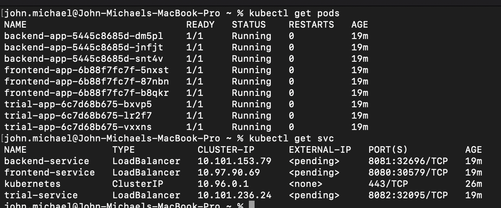
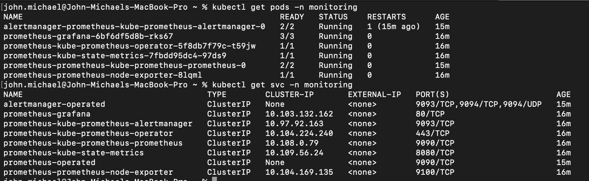
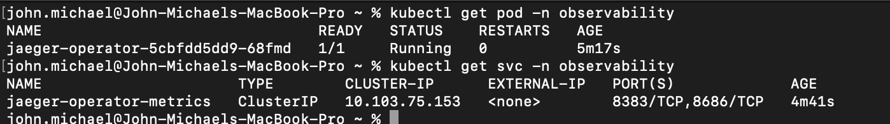

## Setup the Jaeger and Prometheus source
*COMPLETED:* Expose Grafana to the internet and then setup Prometheus as a data source. Provide a screenshot of the home page after logging into Grafana.
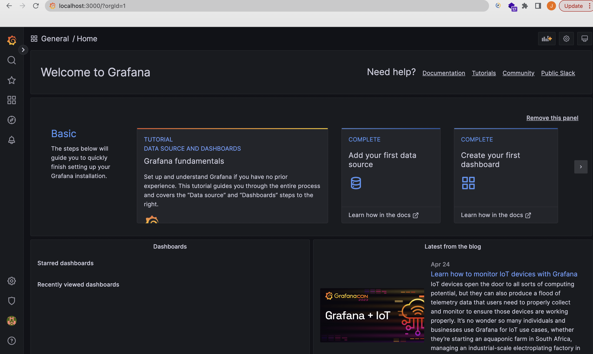

## Create a Basic Dashboard
*COMPLETED:* Create a dashboard in Grafana that shows Prometheus as a source. Take a screenshot and include it here.
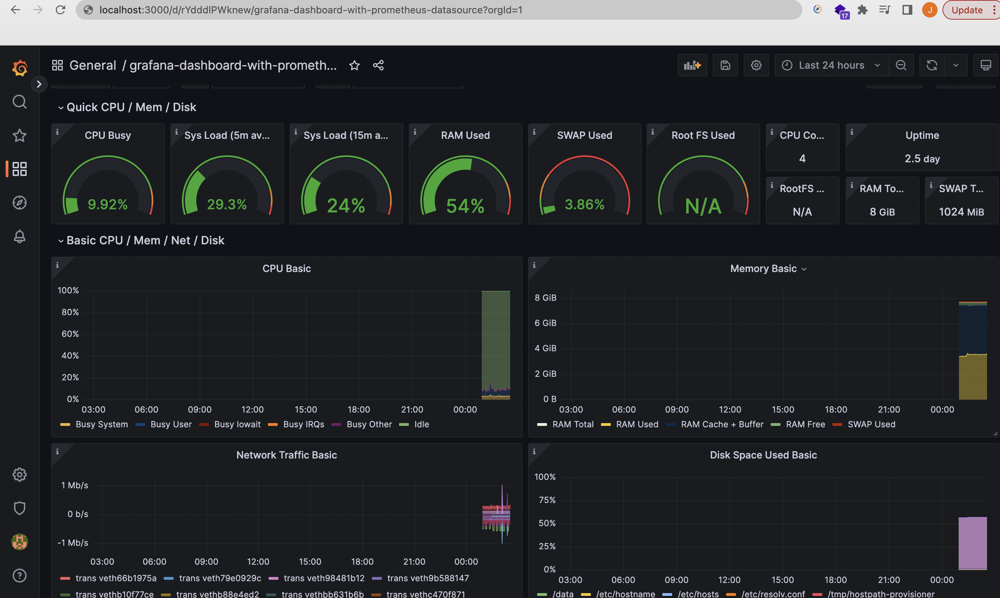

## Describe SLO/SLI
*COMPLETED:* Describe, in your own words, what the SLIs are, based on an SLO of *monthly uptime* and *request response time*.

SLIs provides a measurable context of a system's performance. It is frequently stated as a percentage or ratio and is used to assess how well a service is performing in relation to its objectives or goals. For many characteristics of a service, such as response time, uptime, error rates, or other performance indicators, SLIs can be specified. An SLI for a website, for instance, may be the proportion of requests that are fulfilled in within a predetermined amount of time, like three seconds.

Based on an SLO of monthly uptime, we can have the following specifications:

    SLO: the service uptime for the month of January will not be less than 99.99%. 

    SLI: the service uptime for the month of Janauary was 99.95%

Based on an SLO of request response time, we can have the following specifications:

    SLO: the average request response time will be less than 300ms during the month of May

    SLI: the average request response time for the month of May was 200ms

Both scenario depicted above clearly describes what an SLI is. It is the specific metric of the performance/availability of a service. While SLO gives a goal or objective, SLI indicates if the goal or objective was met.

## Creating SLI metrics.
*COMPLETED:* It is important to know why we want to measure certain metrics for our customer. Describe in detail 5 metrics to measure these SLIs. 

The metrics to capture the SLIs will be focused on the four golden signals. 5 metrics I'll be considering are:

1. Latency: the SLI metric will be the average time it takes to complete a request.

2. Traffic: the SLI metric will be the number of requests processed within 60,000 ms

3. Errors: the SLI metric will be the number of requests that returns responses without 200 Http status code within an hour period.

4. Saturation: the SLI metric will be the amount of memory used up by the service.

5. Throughput: the SLI metric will be the number of requests the system can handle within a minute.

## Create a Dashboard to measure our SLIs
*COMPLETED:* Create a dashboard to measure the uptime of the frontend and backend services We will also want to measure to measure 40x and 50x errors. Create a dashboard that show these values over a 24 hour period and take a screenshot.

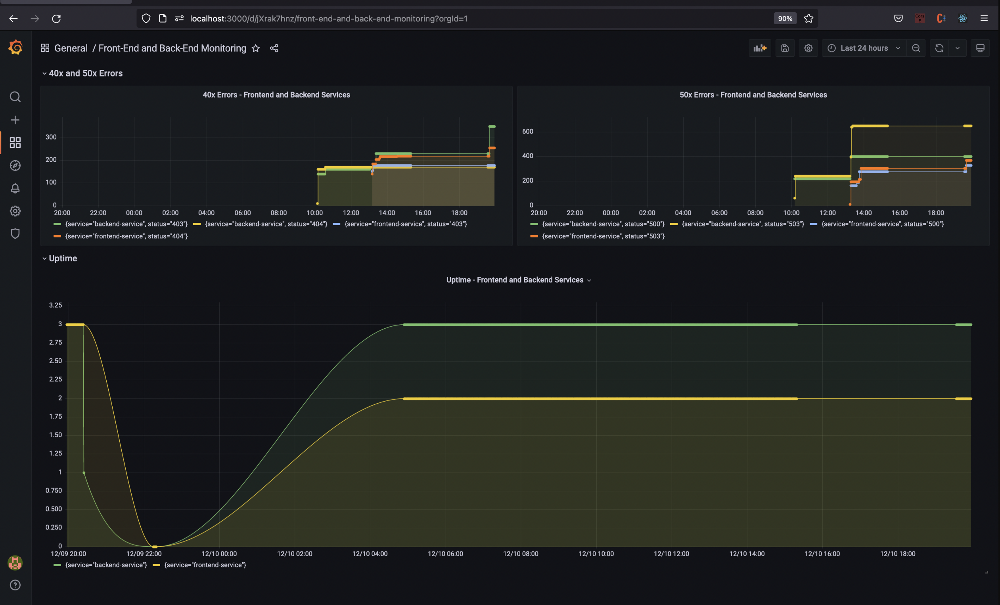

## Tracing our Flask App
*COMPLETED:*  We will create a Jaeger span to measure the processes on the backend. Once you fill in the span, provide a screenshot of it here. Also provide a (screenshot) sample Python file containing a trace and span code used to perform Jaeger traces on the backend service.

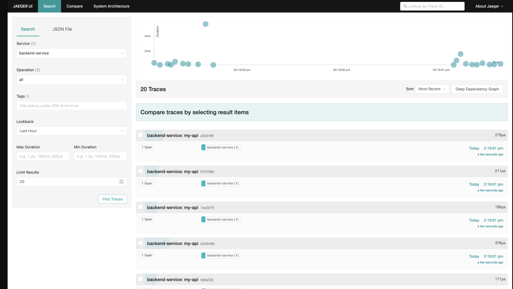

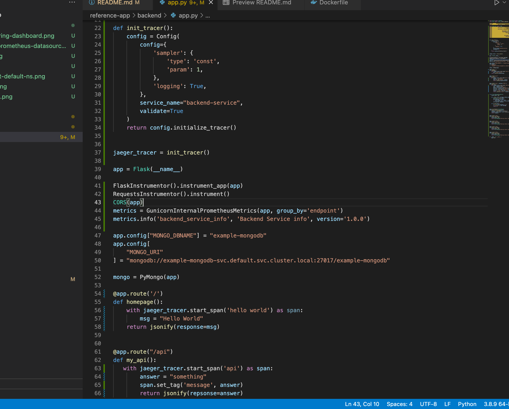

## Jaeger in Dashboards
*COMPLETED:* Now that the trace is running, let's add the metric to our current Grafana dashboard. Once this is completed, provide a screenshot of it here.

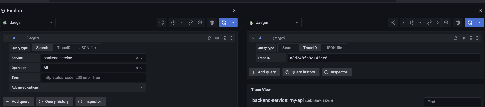

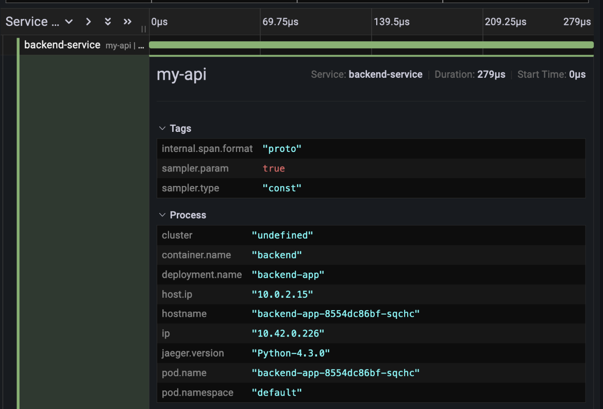

## Report Error
*COMPLETED:* Using the template below, write a trouble ticket for the developers, to explain the errors that you are seeing (400, 500, latency) and to let them know the file that is causing the issue also include a screenshot of the tracer span to demonstrate how we can user a tracer to locate errors easily.

TROUBLE TICKET

Name: Internal Server Error (500 Http Status) on the /api path of the backend service

Date: April 30, 2022 10:23:05

Subject: Internal Server Error on /api endpoint

Affected Area: Backend Service

Severity: High

Description: Accessing the /api path of the backend service resulted in 'NameError' error.

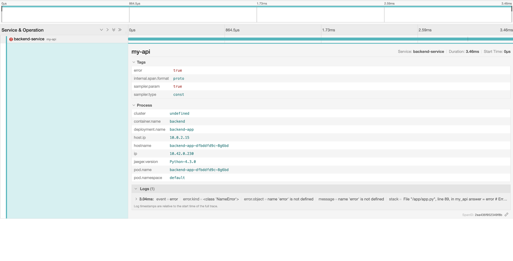

## Creating SLIs and SLOs
*COMPLETED:* We want to create an SLO guaranteeing that our application has a 99.95% uptime per month. Name four SLIs that you would use to measure the success of this SLO.

To capture the above SLO, the following SLIs would be captured:

1. Availability (What percentage of overall requests result in 200 as opposed to 400 or 500 errors & Total number of requests received over time)

2. Server Response Rate (request time (in ms) for successful requests
request time (in ms) for failed requests
)

3. Error Rate (500 errors - 500 errors are more severe: the application is unable to start or completely crashes during execution of a request.
400 errors - 404 errors are less severe but also need urgent attention.)

4. Resource Consumption (% CPU usage allocated per service as configured in yaml for example
% CPU usage available on host)

## Building KPIs for our plan
*COMPLETED*: Now that we have our SLIs and SLOs, create a list of 2-3 KPIs to accurately measure these metrics as well as a description of why those KPIs were chosen. We will make a dashboard for this, but first write them down here.

KPIs for measuring availability SLI:
1. Percentage of overall requests successfully completed.
2. Summation of requests processed over a span of time

KPIs for measuring server response rate SLI:

1. Time taken for processing successful requests
2. Time taken for processing failed requests

KPIs for measuring error rate SLI:

1. Number of Internal Server Errors with 500 Http status over a span of time.
2. Number of 4xx errors over a span of time

KPIs for measuring Reasource Consumption SLI:

1. Service CPU allocation
2. Service CPU usage

## Final Dashboard
*COMPLETED*: Create a Dashboard containing graphs that capture all the metrics of your KPIs and adequately representing your SLIs and SLOs. Include a screenshot of the dashboard here, and write a text description of what graphs are represented in the dashboard.  

Graph1: Flask HTTP request total: Status 200
This graph represents the total number of successfully completed requests

Graph2: Flask HTTP request exceptions
This graph represents the number of failed requests

Graph3: 5xx Errors
This graph represents the number of requests with 5xx response status

Graph4: 4xx Errors
This graph represents the number of requests with 4xx response status

Graph5: Failed responses per second: 
This represents the error rate of the service

Graph6: Uptime frontend service
This graph represents to total available time of the front end service

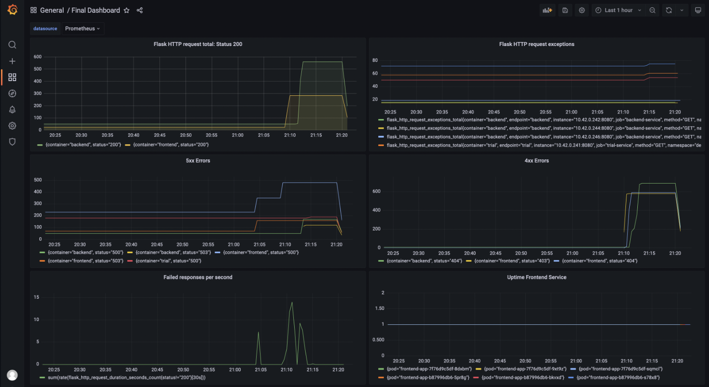

Graph7: Pods not in ready state:
This graph captures the unavailability period of the service

Graph8: Pods restarts per namespace
This graph also captures the unavailability period of the service

Graph9: CPU Usage
This graph captures CPU usage of services

Graph10: Average response time:
This graph represents the average response time of services

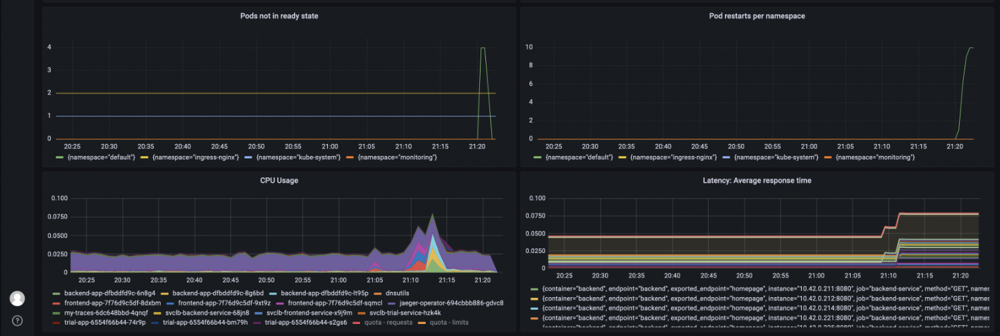